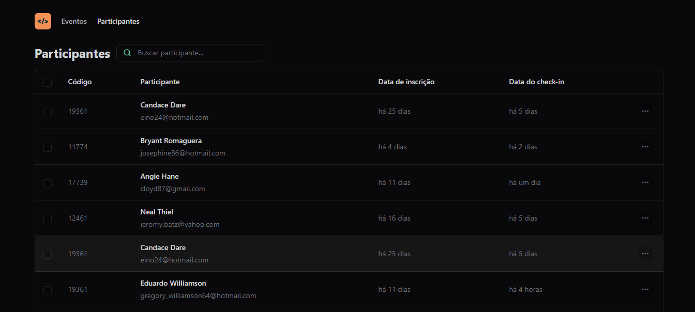

# pass.in

Este é o front-end do pass.in, uma aplicação de gestão de participantes em eventos presenciais.

Por meio deste, é possível visualizar os participantes de um evento distribuídos em várias páginas, contendo, cada qual, até 10 participantes.

No momento, a aplicação, através do consumo da [API](https://github.com/andrade-tiago/rocketseat-pass.in-api), permite:

- [x] visualizar os participantes de um evento específico;
- [x] filtrar os participantes do evento pelo nome;
- [x] salvar e recuperar o filtro e a página atual por meio do uso de URL state.
